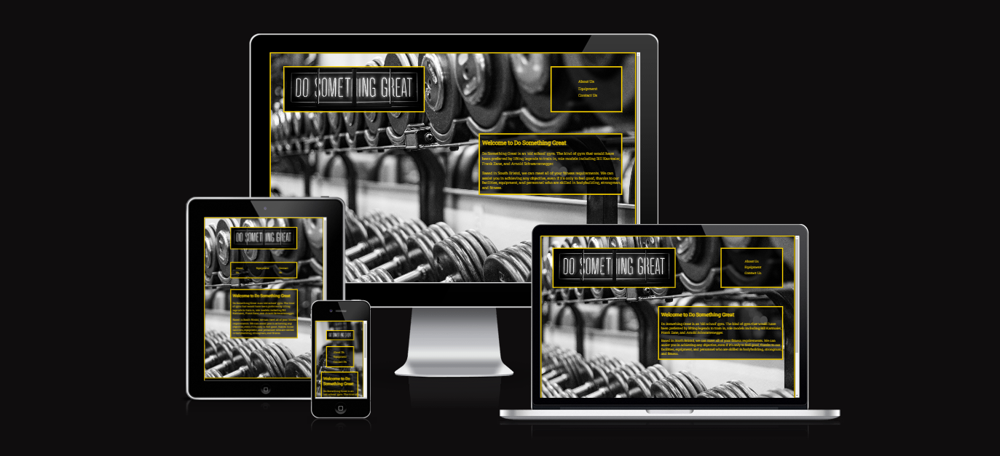

<h1 align="center">Do Something Great Gym Website</h1>

[View the live project here.](https://sleighton-dot-com.github.io/GYM-Website/)

This is the main information website for a gym called Do Something Great. It is designed to be responsive and accessible on a  variety of devices, making it easy to navigate for new visitors wantings to join the gym or returning visitors wanting to find out more information.

<h2 align="center"></h2>

---

* ## User Experience (UX)

    *   ### User stories

        -   #### First-Time Visitor Goals

            1. I want to quickly understand the website's main objective and discover additional information about the gym as a first-time visitor.
            2. I want to be able to find stuff on the site quickly as a first-time visitor.
            3. Additionally, I want to find their social media handles so I can check out how popular and well-known they are on those platforms.

        *   #### Returning Visitor Goals

            1. I'm a returning visitor and would like to learn more about the gym.
            2. I'm a returning visitor and would like to know how to reach the gym to ask any queries I might have.
            3. I wish to find social media links as a returning visitor.

        *   #### Frequent User Goals
            1. As a Frequent User, I want to check to see if there is any newly added equipment to the gym.
            2. As a frequent user, I want to see if the gym has published any new blog entries or joined any new social media networks.
       
    *   ### Design
        -   #### Colour Scheme
            -   The two main colours used are gold and black for a contrasting site with black and white photos providing a moody aesthetic.
        -   #### Typography
            -   The Roboto Slab font is the main font used throughout the whole website with Serif as the fallback font in case for any reason the font isn't being imported into the site correctly. The Roboto Slab font embodies a sophisticated look that grabs the viewer's attention through its seamless fusion of solidity and beauty.
        -   #### Imagery
            -   The large background hero image is intended to be eye-catching and draw users in. It is also relevant to the type of venue the site is for. 

    *   ### Wireframes

        -   About Us Page Wireframe - [View](https://github.com/SLeighton-dot-com/GYM-Website/blob/main/assets/Wireframes/About%20Us%20Page.pdf)
        -   Equipment Page Wireframe - [View](https://github.com/SLeighton-dot-com/GYM-Website/blob/main/assets/Wireframes/Equipment%20Page.pdf)
        -   Contact Us Page Wireframe - [View](https://github.com/SLeighton-dot-com/GYM-Website/blob/main/assets/Wireframes/Contact%20Us%20Page.pdf)
        -   Thank You Page Wireframe - [View](https://github.com/SLeighton-dot-com/GYM-Website/blob/main/assets/Wireframes/Thank%20You%20Page.pdf)
        -   404 Error Page Wireframe - [View](https://github.com/SLeighton-dot-com/GYM-Website/blob/main/assets/Wireframes/404%20Error%20Page.pdf)

---

*   ## Features

    - Responsive on various device sizes down to a screen width of 320px.
    - A clean and simple navigation menu to aid users in moving about the site, with simple to understand menu items for quick referencing to select the correct link for where the user wants to go.
    - Interactive menu items and social media links provide interactivity to users.


    - Media queries are used to keep the project responsive, from large High Definition pc monitors down to small mobile phone displays.
    - Flexbox to adjust the gallery width on the equipment.html page to fit the space available and to hide images as the space decreases.
    - Favicon icons have been added to give the project a more professional look and to aid a user in finding the site among many open tabs.
    - A floating text box over the background that contains site information content is responsive for the width of the screen.
    - A consistent footer that is recognisable across the project aiding in usability.
    - Font Awesome icons have been added to give the users a sense of familiarity with where the links will take them.
    - Including an input form in the contact.html for asking any questions that the user may have gives the user a sense of being welcome to the venue.
    - Added a link at the end of the About Us section to prompt users to progress through the site.

---

* ## Technologies Used
    
    * ### Languages Used

        -   [HTML 5](https://en.wikipedia.org/wiki/HTML5)
        -   [CSS 3](https://en.wikipedia.org/wiki/Cascading_Style_Sheets)

        For This project, I stuck to pure HTML and CSS to showcase my ability to write my own custom code.

    * ### Frameworks, Libraries & Programs Used

        1. [Hover.css:](https://ianlunn.github.io/Hover/)
        - Hover.css was used on the navigation items in the menu to add a border while being hovered over.
        2. [Google Fonts:](https://fonts.google.com/)
        - Google fonts were used to import the 'Roboto Slab' font into the style.css file which is used on all pages throughout the project.
        3. [Font Awesome:](https://fontawesome.com/)
        - Font Awesome was used on the social media icons in the footer for easy identification.
        4. [Git:](https://git-scm.com/)
        - Git was used for version control by utilizing the Gitpod terminal to commit to Git and Push to GitHub.
        5. [GitHub:](https://github.com/)
        - GitHub is used to store the project's code after being pushed from Git.
        6. [CodeAnywhere:](https://app.codeanywhere.com/)
        - CodeAnywhere was used as the IDE platform for website development.
        7. [Balsamiq:](https://balsamiq.com/)
        - Balsamiq was used to create the [wireframes](https://github.com/SLeighton-dot-com/GYM-Website/tree/main/assets/Wireframes) during the design process.
        8. [Favicon Generator:](https://www.favicon-generator.org/)
        - Favicon Generator was used to create the [Favicons](https://github.com/SLeighton-dot-com/GYM-Website/tree/main/assets/favicon) for the project.

---

* ## Testing

    * ### Validation

        The W3C Markup Validator and W3C CSS Validator Services were used to validate every page of the project to ensure there were no syntax errors in the project. CSS has been auto-prefixed with Autoprefixer CSS online. Each page was assessed through Web Accessibility Evaluation Tool for any errors and Lighthouse on the Google Chrome Dev Tools for Accessibility and Best Practices.

        -   [W3C Markup Validator](https://jigsaw.w3.org/css-validator/#validate_by_input) 
        -   [W3C CSS Validator](https://jigsaw.w3.org/css-validator/#validate_by_input) 
        -   [Auto-Prefixer](https://autoprefixer.github.io/) 
        -   [Web Accessibility Evaluation Tool](https://wave.webaim.org/)

    * ### Testing User Stories from User Experience (UX) Section

        * #### First-Time Visitor Goals

            1. I want to quickly understand the website's main objective and discover additional information about the gym as a first-time visitor.

                - Upon entering the site, users are greeted with a clean and easily readable About Us section with a simple and easy-to-use navigation menu just above it. 
                - The Hero Image gives an instant visual clue to the type of venue this website is for.

            2. I want to be able to find stuff on the site quickly as a first-time visitor.

                - The site has been designed to be simple and easy to navigate with a clean navigation bar, with easy-to-read links that describe page they are navigating to.
                - In the footer at the bottom of every page, there are links to social media platforms so that they have multiple choices of places to navigate to.
                - After submitting the message form on the Contact Us page, the user is navigated to the Thank You page and instructed to navigate back to the main site.

            3. Additionally, I want to find their social media handles so I can check out how popular and well-known they are on those platforms.
            
                - On every page throughout this site, there are social media links in the footer of the page.
                - The styling of the footer and social media links are universal with recognisable logos making them easy to navigate and recognise which site the link takes the user.

        * #### Returning Visitor Goals

            1. I'm a returning visitor and would like to learn more about the gym.

                - The equipment page lists all the equipment information that new or returning site users would need to know about.

            2. I'm a returning visitor and would like to know how to reach the gym to ask any queries I might have.

                - The navigation bar clearly shows a link to the "Contact Us" Page.
                - Here they can fill out the simple-to-use form on the page.

            3. I wish to find social media links as a returning visitor.

                - The footer contains links to the venue's social media platforms.
                - To make sure the user can quickly return to the website, every link they click will open in a new tab.

        * #### Frequent User Goals

            1. As a Frequent User, I want to check to see if there is any newly added equipment to the gym.

                - All the equipment details that new or returning site visitors would need to know are listed on the equipment page.

            2. As a frequent user, I want to see if the gym has published any new blog entries or joined any new social media networks.

                - Social media icons are located in the footer of each page on this website and are universal throughout the site.

    * ### General Testing

        -   The Website was tested on Google Chrome, Microsoft Edge, Mozilla Firefox, Apple Safari and Opera browsers at various screen widths, all relating to certain viewing devices.

            |  Screen size | Device  | Chrome + Edge+ Firefox + Opera + Safari | 
            | :-----------: | :---: | :---: |
            | 360px | Galaxy S8+ | Displaying and Responsive |
            | 393px | Pixel 5 | Displaying and Responsive |
            | 414px | iPhone XR | Displaying and Responsive |
            | 540px | Surface Duo | Displaying and Responsive |
            | 667px | iPhone SE (landscape) | Displaying and Responsive |
            | 768px | iPad Mini | Displaying and Responsive |
            | 820px | iPad Air | Displaying and Responsive |
            | 912px | Surface Pro 7 | Displaying and Responsive |
            | 1024px | iPad Mini (landscape) | Displaying and Responsive |
            | 1280px | Laptop/Desktop | Displaying and Responsive |
            | 1920px | HD Laptop/Desktop | Displaying and Responsive |

        -   The website was viewed on a Desktop, Android Tablet & Android Phone as part of my testing.
        -   I asked friends to view the project on Apple products and let me know how it looked and to try all links across the site.

    * ### Fixed Bugs

        - Flexbox extending over footer - Fixed by adding ```display: none;``` to the Flexbox items that are no longer needed to be displayed.
        - The main Divs holding information was overlapping nav and footer Divs on decreasing screen sizes - Fixed by changing ```top``` and ```width``` attributes to information Divs with media queries as the screen width decreased.
        - Media queries the setting the ```top``` and ```width``` made the Div's display differently on the deployed site than they did on CodeAnywhere - Fixed by using the deployed site as a reference and changed the px value that the media queries activated.
        - Input form wouldn't action a thank you message and would allow you to submit a blank form - Fixed this issue with an action to open a specific page with a thank you acknowledgement and used the ```required``` setting for both inputs.
        - Using ```height: vh;``` to control Div heights for backgrounds was causing issues when devices were rotated - Fixed by using ```height: px;``` to set Div heights as needed.

---

* ## Deployment

    * ### GitHub Pages

        The project was deployed to GitHub Pages using the following steps...

        1. Locate the [GitHub repository](https://github.com/SLeighton-dot-com/GYM-Website) you want to deploy.
        2. Go to your repository's "Settings" tab.
        3. Scroll down to the "GitHub Pages" section.
        4. Under the "Source" heading, select the "Main" branch.
        5. Choose the folder where your website files are located, this would be the "root" directory.
        6. Click "Save" or "Save and Continue."
        7. Wait for deployment: GitHub Pages will automatically build and deploy your website. It may take a few minutes. Once the process is complete, you'll see a green checkmark and a URL where your website is published.

        Verify the deployment: Open the provided URL in your browser to verify that your website is deployed correctly. It may take some time for the changes to propagate.


    * ### Forking the GitHub Repository

        By forking the GitHub Repository we make a copy of the original repository on our GitHub account to view and/or make changes without affecting the original repository by using the following steps...

        1. Locate the [GitHub repository](https://github.com/SLeighton-dot-com/GYM-Website) you want to fork. You can search for it using the search bar at the top of the GitHub page, or you can navigate to it directly if you know the URL.
        2. On the repository page, you'll see a button with the label "Fork" in the top right corner of the page. Click on the "Fork" button.
        3. GitHub will prompt you to choose the location where you want to fork the repository. This will create a copy of the repository under your GitHub account.
        4. GitHub will start the forking process, which may take a few moments. 

    * ### Making a Local Clone

        1. Log in to GitHub and locate the [GitHub Repository](https://github.com/SLeighton-dot-com/GYM-Website)
        2. On the repository page, click on the green "Code" button. A drop down menu will appear with the repository URL. You can click on the clipboard icon to copy the URL.
        3. Open Git Bash.
        4. Use the cd command in the terminal to navigate to the directory where you want to clone the repository and press enter.
        5. Next type `git clone`, and then paste the URL you copied in Step 2.

        ```
        $ git clone https://github.com/SLeighton-dot-com/GYM-Website
        ```

        6. Press Enter. Your local clone will be created.

---

* ## Credits

    * ### Code

        - Flexbox - [CSS Tricks](https://css-tricks.com/snippets/css/a-guide-to-flexbox/) - This tutorial was sourced for me by tutor support and helped me to code in a flexbox for my gallery on the equipment.html page.
        - Font Awesome - [Font Awesome](https://fontawesome.com/) - I used these icons for my social media links in my footer.
        - Favicon - [Favicon](https://www.favicon-generator.org/) - Used for the code in having tab icons.
        - Google Fonts - [Google Fonts](https://fonts.google.com/) - Used for importing fonts.

    * ### Content

        - All content was written by me.

    * ### Media

        -   All images were sourced from [Unsplash](https://unsplash.com/) from the following creators:

            - [Alora Griffiths](https://unsplash.com/@aloragriffiths)
            - [Jesper Aggergaard](https://unsplash.com/@aggergakker)
            - [Anastase Maragos](https://unsplash.com/@visualsbyroyalz)
            - [Nathan Dumlao](https://unsplash.com/@nate_dumlao)
            - [Rachel Moore](https://unsplash.com/@rachmoorephoto)
            - [Alexander Jawfox](https://unsplash.com/@jawfox_photography)
            - [Corey Young](https://unsplash.com/@corey_untitled)
            - [Malik Shibly](https://unsplash.com/@malikshibly)
            - [Evan Wise](https://unsplash.com/@evanthewise)
            - [Clark Tibbs](https://unsplash.com/@clarktibbs)
            - [Victor Freitas](https://unsplash.com/@victorfreitas)
            - [Mohamed Fareed](https://unsplash.com/@lifesbro)
            - [Samuel Girven](https://unsplash.com/@samuelgirven)
            - [Andrew Valdivia](https://unsplash.com/@donovan_valdivia)
            - [Luis Reyes](https://unsplash.com/@tuga760)


    * ### Acknowledgements

        -   My Mentor Rory Patrick for helpful feedback and advice during mentor sessions throughout this project.
        -   The Tutor support team at Code Institute for their support and guidance.